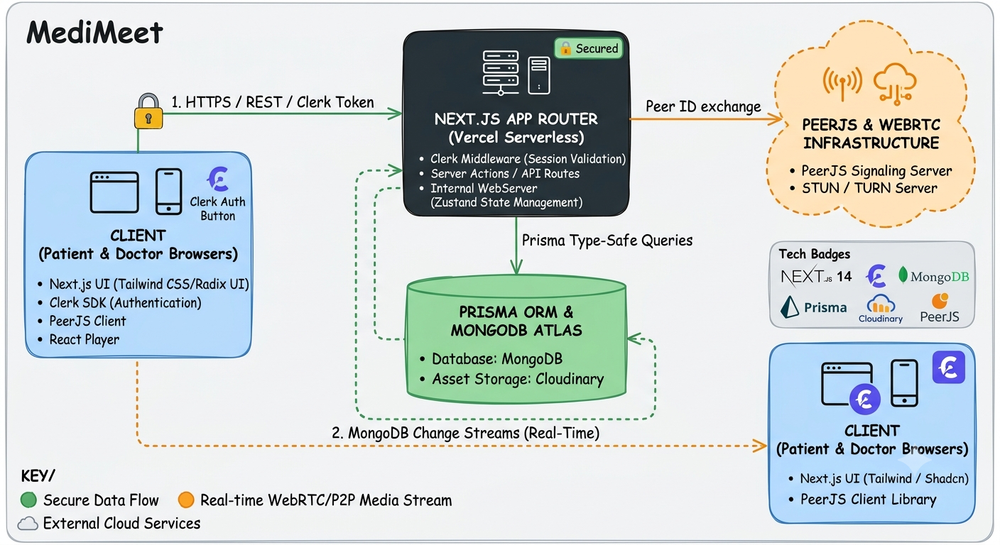

# MediMeet 🏥💬

> A production-ready, full-stack doctor-patient appointment scheduling and real-time video consultation platform built with Next.js 14, Clerk, Prisma, MongoDB, and PeerJS.

[](https://your-medimeet-demo.vercel.app)
[](https://nextjs.org/)
[](https://clerk.com/)
[](https://www.prisma.io/)
[](https://www.mongodb.com/)

---

## 📸 System Architecture



---

## ✨ Core Features

* **Multi-Role Authentication:** Secure identity management powered by **Clerk** supporting distinct workflows for **Patients** and **Doctors**.
* **Smart Appointment Booking:** Interactive calendar and time-slot management utilizing `@mui/x-date-pickers` and `date-fns` for accurate, double-booking-free scheduling.
* **1-on-1 Low-Latency Video Consultation:** Peer-to-peer audio/video streaming built with **PeerJS (WebRTC)** and rendered using `react-player`.
* **Profile & Medical Document Storage:** Cloud-based avatar and document uploads via **Next-Cloudinary**.
* **Global Client State & Notifications:** Fast client-side state handling with **Zustand** and accessible feedback components built on **Radix UI primitives** and **Sonner**.

---

## 🛠️ Tech Stack

| Layer | Technologies |
| :--- | :--- |
| **Framework** | Next.js 14 (App Router, Server Actions) |
| **Authentication** | Clerk Auth + Svix (Webhook Verification) |
| **UI & Styling** | Tailwind CSS, Radix UI Primitives, MUI Date Pickers, Lucide Icons |
| **State Management** | Zustand |
| **Database & ORM** | MongoDB Atlas + Prisma ORM |
| **Media & P2P** | PeerJS (WebRTC), React Player, Next-Cloudinary |
| **Validation & Utilities** | Zod, Date-fns, Axios, Lodash |

---

## ⚡ Engineering Challenges & Solutions

### 1. Robust User Syncing via Svix Webhooks & Clerk
* **Challenge:** Syncing Clerk authentication events (user creation/deletion) with the core MongoDB database reliably without blocking the UI or introducing race conditions.
* **Solution:** Implemented secure webhook endpoints verified using `svix` headers, triggering atomic upsert operations in Prisma to maintain strict data consistency between Clerk identity records and application data models.

### 2. Peer-to-Peer Signaling & Media Stream Lifecycle
* **Challenge:** Managing WebRTC peer connections dynamically in a Next.js single-page environment without leaking media stream tracks or dropping calls on component re-renders.
* **Solution:** Encapsulated PeerJS event listeners and `MediaStream` state management inside custom hooks, utilizing `usehooks-ts` and `Zustand` to manage call states cleanly and unmount tracks safely when calls terminate.

---

## 🚀 Getting Started Locally

### 1. Prerequisites
* **Node.js:** `v18.x` or higher
* **MongoDB:** Local instance or MongoDB Atlas Connection String
* **Clerk Account:** Public and Secret Keys

### 2. Installation & Setup

```bash
# Clone the repository
git clone [https://github.com/harsh-1214/Medimeet.git](https://github.com/harsh-1214/Medimeet.git)
cd medimeet

# Install dependencies
npm install

#Run the app
npm run dev